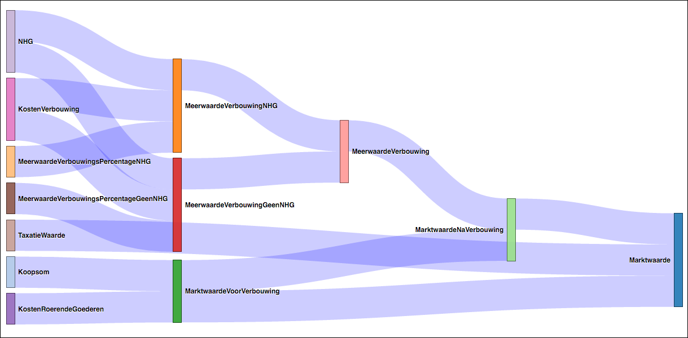

# scala-rules
Scala-Rules is a forward chaining rule engine, built in [Scala](https://www.scala-lang.org). The engine comes with a DSL with which derivations can be modelled as small steps that combine into large derivated networks of facts.

The project started with a Dutch DSL to facilitate bankers writing mortgage-related calculations. An English translation of the DSL is still in progress.

# Getting Started

# Future Work

The DSL is currently only available in Dutch. We are working on translating it into English and expect this to be releasable in the next month.

In our project, we are using a utility project to visualise the dependency graphs generated by the engine. These graphs provide great insights in the execution order of the engine and allow for easy review of derivations by non-programmers. This project cannot as of yet be released as an open source module. We are working on generalising this and expect it to be releasable in the next two months. Here’s an example of what a derivation graph looks like:

